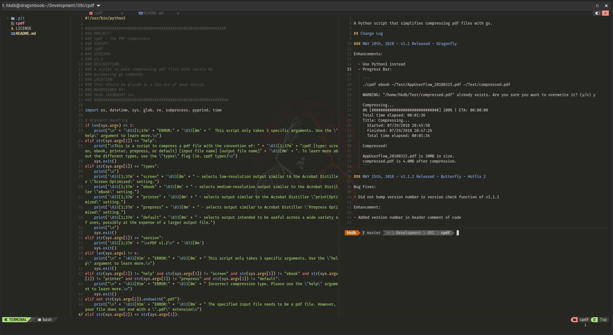

# Neovim + NVchad + Customization Automated Installation
maintained by hkdb <hkdb@3df.io>

## SUMMARY

<b>NOTE: This repo is a work in progress (WIP) and has not been tested.</b>

Automated installation of [neovim](https://neovim.io) + [NVchad](https://github.com/NvChad/NvChad) + additional customizations.

Customized for use with:

- Bash
- Go
- Python
- Javascript
- Svelte
- JSON
- Docker
- Lua 

## ADDITIONAL CUSTOMIZATION

- [ray-x/go.nvim](https://github.com/ray-x/go.nvim)
- [ray-x/goihua.lua](https://github.com/ray-x/goihua.lua)
- [neovim/nvim-lspconfig](https://github.com/neovim/nvim-lspconfig)
- [williamboman/mason.nvim](https://github.com/williambowman/mason.nvim)
  - lua-language-server
  - html-lsp
  - prettier
  - stylua
  - gopls
  - goimports
  - goimports-reviser
  - bash-language-server
  - svelte-language-server
  - json-lsp
  - python-lsp-server
  - dockerfile-language-server
  - docker-compose-language-service
  - terraform-ls
- [folke/persistence.nvim](https://github.com/folke/persistence.nvim)
- Shortcuts:
  - Shift + Tab = Next Window Tab
  - Shift + Right = Next Window Tab
  - Shift + Left = Previous Window Tab
  - Alt + 1 = Jump to Window Tab 1
  - Alt + 2 = Jump to Window Tab 2
  - Alt + 3 = Jump to Window Tab 3
  - Alt + 4 = Jump to Window Tab 4
  - Alt + 5 = Jump to Window Tab 5
  - Alt + 6 = Jump to Window Tab 6
  - Control + Delete = Close Window Tab
  - Control + q = Close All & Quit
  - Space + r = Restore Previous Session

## SUPPORTED OS

- Arch Based Linux
- Debian Based Linux
- Fedora Based Linux
- MacOS (Expects that you have homebrew installed)

## INSTALL

1. `cd ~/.config`
2. `git clone https://github.com/hkdb/nvim-install.git`
3. `cd nvim-install`
4. `./install.sh`
5. May or may not need to manually do `:TSInstall <language>` for proper syntax highlighting

## CHANGELOG

- 04292023 - [WIP] Interim nvim deb fix + go ppa
- 04112023 - [WIP] Fixed install format
- 04112023 - [WIP] Fixed arch based install
- 04052023 - [WIP] Added nodejs dependency
- 04042023 - [WIP] Added terraform-ls, glow, & dependencies + install scripts fix
- 04042023 - [WIP] Fixed perms + scripts
- 04032023 - [WIP] Initial commit

## DISCLAIMER

This repo is sponsored by 3DF OSI and is maintained by volunteers. 3DF Limited, 3DF OSI, and its volunteers including the author in no way make any guarantees. Please use at your own risk!

To Learn more, please visit:

[https://osi.3df.io](https://osi.3df.io)

[https://3df.io](https://3df.io)

